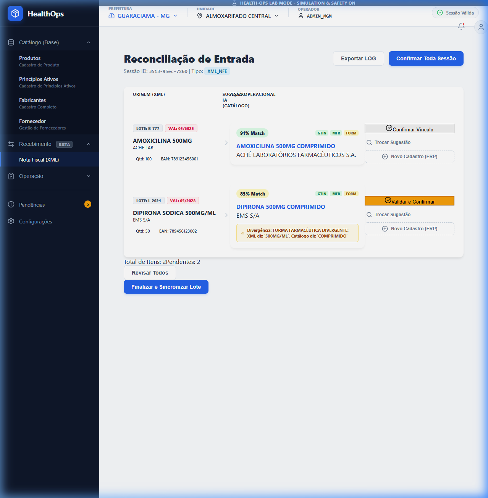
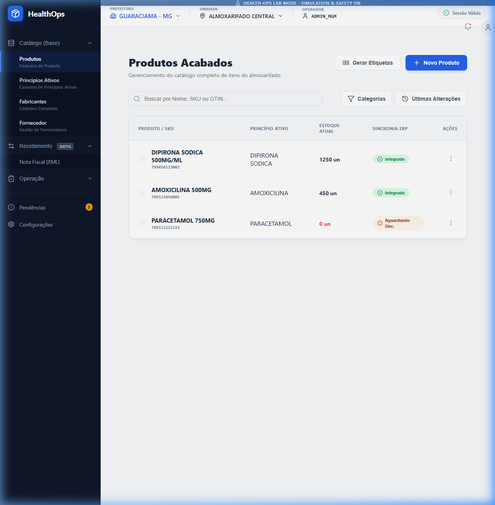

# Regras de Negócio: Entrada Direta (Vivver Baseline)

Este documento detalha o funcionamento da tela de Entrada Direta de Produtos no ERP Vivver, servindo como base para a modelagem da nossa solução simplificada.

## 1. Referência Visual (Vivver)

*Seleção do motivo de movimentação (Ex: Entrada Inicial, Ajuste).*

*Busca por código interno ou nome do item no catálogo.*

*Vínculo do fabricante ao lote específico.*

## 2. Regras de Obrigatoriedade e Comportamento

### Cabeçalho (Header)
* **Motivo de Entrada**: [PADRÃO FIXO]. Para este cliente, o padrão é o **Código 9** (ENTRADA INICIAL OU CONTAGEM DO ESTOQUE). Deve ser parametrizável para outras prefeituras.
* **Entrada Oficial Sigaf**: [OPCIONAL]. Por padrão "Não".

### Fontes de Entrada (HealthOps)
O sistema aceitará duas formas de alimentar a grade:
1. **Entrada Manual**: Campos individuais (Produto, Fabricante, Lote, etc.) com busca inteligente.
2. **Importação via Planilha (Excel)**: O sistema mapeia as colunas da planilha para a grade de conferência.

### Inteligência e Validação Preventiva
* **Check-up ERP**: Ao adicionar um item (manual ou via Excel), o sistema deve realizar um `GET` no Vivver para validar a existência do Produto/Fabricante.
* **Estado de Alerta**: Itens importados via Excel que não forem encontrados no Vivver devem ser destacados em vermelho, impedindo a persistência final até que o vínculo seja resolvido.
* **Edição em Grade**: Todos os itens na grade (independente da fonte) devem permitir edição rápida de Lote e Validade antes do salvamento final.

## 3. Fluxo de Ação do Operador (HealthOps)
1. Define/Confirma o motivo (Padrão 9).
2. Arrasta a planilha ou insere os itens manualmente.
3. Revisa os itens na grade (ajusta o que for necessário).
4. Resolve pendências de itens não encontrados no ERP.
5. Clica no **Botão Disquete (Salvar)** para realizar o commit atômico no Vivver.

---
*Documentação gerada em 14/05/2026 com base em análise forense do ERP Vivver.*
