# Architectural Impact — Context Commit Protocol

**Data:** 15/05/2026  
**Marco sugerido:** tag `context-engine-stable-v1`

---

## 1. Resumo do impacto

A descoberta do protocolo `create_conexao` transformou o HealthOps de um integrador **guiado por UI** em um integrador **guiado por contrato transacional com o ERP**. O contexto operacional deixou de ser um estado React negociável e passou a ser uma **entidade com ciclo de vida** validada pelo backend após commit soberano.

---

## 2. Arquitetura antes vs depois

```mermaid
flowchart TB
  subgraph before [Antes]
    UI1[TopBar_escolhe]
    UI1 --> PW1[Playwright_preenche]
    PW1 --> Guess[Heuristica_header_ou_sleep]
    Guess --> Cache1[Cache_adapter_possivelmente_stale]
  end

  subgraph after [Depois]
    UI2[TopBar_intencao]
    UI2 --> API[session.py_OperationStore]
    API --> PW2[ContextSwitcher]
    PW2 --> Commit[ConexaoCommitClient]
    Commit --> ERP[Vivver_create_conexao]
    ERP --> Bar["#unidade_info_barra"]
    Bar --> Ctx[OperationalContext_hidratado]
    Ctx --> UI2
  end
```



---

## 3. Mudanças por camada

### 3.1 Backend — Context Engine

| Capacidade | Implementação |
|------------|-----------------|
| Commit protocol | `ConexaoCommitClient` |
| Manobra transacional | `PlaywrightContextSwitcher` |
| Forense / snapshot | `commit_trace.py` |
| Resolução setor | `_resolve_sector_id()` — `0` explícito |
| Hidratação soberana | `_hydrate_context_from_desktop_bar()` |
| Discovery corrigido | `codmunicipio` no `where` de setores |

### 3.2 API — Switch como operação

`POST /almox/v1/session/switch` cria `ContextOperation` em `OperationStore`:

```text
REQUESTED → NAVIGATING → SWITCHING → VALIDATING → COMPLETED
                                              ↘ FAILED
                                              ↘ MULTIPLE_CHOICES_REQUIRED
```

O cliente pode pollar `GET /almox/v1/session/operations/{id}` (se exposto) ou receber resultado síncrono na resposta.

**Correlation:** logs estruturados com `operation_id` + `correlation_id` middleware.

### 3.3 Frontend — Perda de soberania contextual (deliberada)

Em `PRODUCTION`:

| Antes | Depois |
|-------|--------|
| `fetchSession` após switch podia sobrescrever unidade | Resultado do switch é fonte imediata |
| Catálogo + session competiam | `lastSwitchRef` bloqueia `/current` stale 60s |
| Overlay sem timeout claro | `SWITCH_TIMEOUT_MS` 130s |

O TopBar **expressa intenção**; não **comita** no ERP.

Arquivos: [`SessionContext.jsx`](../../../frontend/src/core/context/SessionContext.jsx), [`TopBar.jsx`](../../../frontend/src/core/layout/TopBar.jsx).

### 3.4 Documentação e ADRs

| Documento | Papel |
|-----------|--------|
| [COMMIT_PROTOCOL_v1.md](./COMMIT_PROTOCOL_v1.md) | Contrato institucional |
| [CONTEXT_COHERENCE_RULES.md](../../core-platform/CONTEXT_COHERENCE_RULES.md) | Regras de integridade |
| [ADR-004](../../architecture/decisions/ADR-004-context-switching.md) | Troca transacional |
| [ADR-005](../../architecture/decisions/ADR-005-context-integrity.md) | Integridade de contexto |

---

## 4. Contexto como entidade transacional

`OperationalContext` agora representa **sessão ERP validada**, não seleção de dropdown:

```python
# Campos críticos pós-switch
unit_id, sector_id      # IDs soberanos (barra + commit)
unit_name, sector_name  # Enriquecidos via Discovery se necessário
session.csrf_token      # Re-bootstrap pós-rotação
session.cookies         # Inclui _vmx_saude_session novo
```

**Invariante:** não expor módulos de estoque/inventário enquanto `OperationStatus.SWITCHING`.

---

## 5. Por que o switch virou state machine

Motivos:

1. **Latência** — manobra 5–30s; UI precisa de estados intermediários
2. **Negociação** — `MULTIPLE_CHOICES_REQUIRED` não é exception genérica
3. **Auditoria** — `metadata` carrega `snapshot_before`, `commit`, `snapshot_after`
4. **Fail-closed** — `FAILED` / `REVALIDATION_FAILED` não deixam contexto “meio trocado” sem sinalização

Enum: [`OperationStatus`](../../../backend/app/core/auth/operations.py).

---

## 6. Merge parcial controlado (recomendação DEV)

### Incluir no merge / release `context-engine-stable-v1`

- `backend/app/core/auth/adapters/playwright/**` (adapter, clients, trace)
- `backend/app/api/v1/session.py`
- `backend/app/core/auth/operations.py`
- `backend/scripts/lab_context_*.py`
- `backend/evidence/context-switch/**`
- `docs/evidence/context-switch/**`
- `docs/core-platform/CONTEXT_COHERENCE_RULES.md`

### Adiar (UX / observabilidade transitória)

- Overlay `lock-overlay` experimental em `AppShell` (revisar copy/timeout)
- Retries provisórios não documentados no protocolo
- Métricas/heartbeat de Context Drift (roadmap em CONTEXT_COHERENCE_RULES)
- Módulos almox fora do context engine

### Branch strategy

```text
main
 └── release/context-commit-stable  (cherry-pick commit dedicado)
      └── tag: context-engine-stable-v1
```

---

## 7. Capabilities core estabilizados

| Capability | Status |
|------------|--------|
| Context Engine (Playwright orchestrator) | Estável v1 |
| Commit Protocol (`create_conexao`) | Documentado + implementado |
| Context Coherence Rules | Alinhado |
| Session rotation validation | `session_fingerprint` |
| Discovery/Resolution hardening | `sector_id=0`, `codmunicipio` in where |

---

## 8. Próximos passos arquiteturais (não bloqueiam o marco)

- ADR-014 formal referenciando COMMIT_PROTOCOL_v1
- `OperationStore` persistente (multi-worker)
- `AWAITING_USER_SELECTION` em vez de erro para múltiplos setores
- Context Integrity Monitor (heartbeat)

---

## Referências

- [LESSONS_LEARNED.md](./LESSONS_LEARNED.md)
- [README.md](./README.md)
