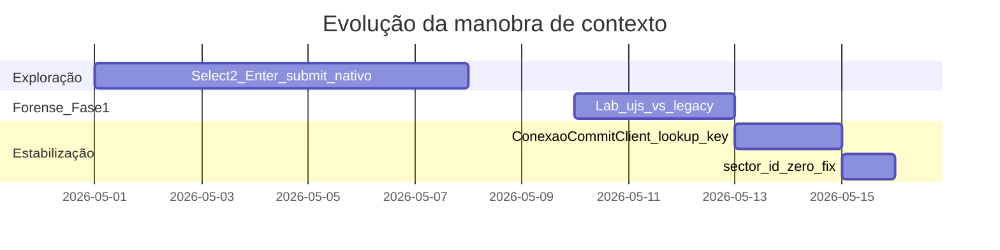

# Context Switch Evolution — Timeline Forense

**Período:** maio/2026  
**Objetivo:** Preservar a linha do tempo de abordagens, hipóteses erradas e descobertas que levaram ao **Context Commit Protocol v1**.

---

## Linha do tempo



---

## Fase 0 — Abordagem inicial (pré-forense)

**Implementação:** `PlaywrightContextSwitcher` com Select2, sleeps fixos, Enter no submit, `wait_for_load_state('domcontentloaded')`, fallback `document.forms[0].submit()`.

**O que funcionava pontualmente:**

- Login e discovery de unidades/setores
- Troca para Almoxarifado `14/10` em alguns runs

**O que falhava:**

- PSF + ATENDIMENTO (`sector_id=0`) na API
- Comportamento intermitente pós-“confirmação”
- Loops de AJAX / página presa em `/conexao`

**Documento da época:** [CONTEXT_SWITCH_DIAGNOSIS.md](../../../CONTEXT_SWITCH_DIAGNOSIS.md) (estado “bloqueio na persistência”).

---

## Fase 1 — Hipóteses erradas (e o que aprendemos)

| Hipótese | Por que parecia plausível | Por que foi descartada |
|----------|---------------------------|-------------------------|
| Falta de `sleep` após Select2 | AJAX lento no Vivver | POST saía sem payload completo; mais sleep não adiciona `lookup_key` |
| `networkidle` como wait | “Esperar rede acabar” | Polling eterno do Vivver; trava |
| `forms[0].submit()` como “força bruta” | Form preenchido na tela | Bypass UJS; 2º POST sem CSRF/commit |
| `authenticity_token` no DOM obrigatório | Rails clássico | Forense: só `meta csrf-token` → header |
| Re-selecionar só unidade/setor | Município “já estava ok” | Cadeia master exige município coerente + `lookup_key` |
| Primeiro setor da lista | “Qualquer setor libera” | Setor errado; viola regra operacional |
| Validar por texto “ALMOXARIFADO” | Heurística rápida | Falso positivo/negativo; não generaliza |
| Header `.unidade_nome` / `.setor_nome` | Nome em docs antigos | Home real usa `#unidade_info` / `#setor_info` |
| Problema “só no React” | UI revertia | API retornava erro em 2s sem tocar ERP |
| Python 3.14 + Playwright | Erro em dev | Ambiente; não é causa do não-persistir |

---

## Fase 2 — Descoberta do protocolo UJS (Fase 1 forense)

**Runbook:** [PHASE1_FORENSIC_RUNBOOK.md](./PHASE1_FORENSIC_RUNBOOK.md)  
**Script:** `backend/scripts/lab_context_commit_trace.py`  
**Cenários isolados:**

| Cenário | Ação | Resultado chave |
|---------|------|-----------------|
| `ujs_click` | `click(#seg_operador_conexao_btn_submit)` + `wait_for_response` | **1** POST xhr, CSRF, `commit=Confirmar` |
| `legacy` | Enter + `forms[0].submit()` | **2** POSTs; segundo incompleto |
| `manual` | Operador humano (baseline ouro) | Não rodado headless no ciclo |

**Descoberta central:** persistência = **um** POST remoto Rails UJS, não submit nativo do formulário `data-remote="true"`.

Artefatos: [`ujs_click_trace.json`](../../../backend/evidence/context-switch/ujs_click_trace.json), [`legacy_trace.json`](../../../backend/evidence/context-switch/legacy_trace.json).

---

## Fase 3 — Remoção permanente de `forms[0].submit()`

**Mudança:** introdução de [`ConexaoCommitClient`](../../../backend/app/core/auth/adapters/playwright/clients/conexao_commit.py).

- `page.click(SUBMIT_BTN)` dentro de `expect_response(create_conexao)`
- Validação de body: `Conexão ativada com sucesso`
- Fail-closed: `COMMIT_NOT_SENT`, `COMMIT_REJECTED`, `COMMIT_RESPONSE_INVALID`

**`PlaywrightContextSwitcher` refatorado:**

- Sem `document.forms[0].submit()`
- Sem heurística “primeiro setor da lista”
- `sector_id` obrigatório (exceto `AUTO_RESOLVE` na API)

---

## Fase 4 — Descoberta do `lookup_key` sync

Forense do payload mostrou campos **duplicados** exigidos pelo fwk-lookup-edit-v3:

```
lookup_key[seg_operador[codmunicipio]]=3128253  +  seg_operador[codmunicipio]=3128253
lookup_key[seg_operador[codunidade]]=14         +  seg_operador[codunidade]=14
lookup_key[seg_operador[codsetor]]=10           +  seg_operador[codsetor]=10
```

**Implementação:**

- `_try_lookup_key()` — preenche campo lookup + Tab
- `_sync_lookup_keys()` — espelha hidden via JS antes do commit
- Re-seleção de **município** no início da manobra

Sem `lookup_key[...]`, o POST pode sair com hidden incoerente → ERP ignora ou responde sem persistir.

---

## Fase 5 — Descoberta da rotação de cookie / fingerprint

**Observação:** após POST bem-sucedido, `_vmx_saude_session` muda.

**Implementação em** [`commit_trace.py`](../../../backend/app/core/auth/adapters/playwright/trace/commit_trace.py):

```text
session_fingerprint = tail(_vmx_saude_session) + ":" + tail(csrf_meta)
```

**Validação na manobra:** `before.session_fingerprint != after.session_fingerprint` → senão `SWITCH_NOT_PERSISTED`.

Isso substituiu validação frágil por substring no nome da unidade.

---

## Fase 6 — Barra soberana e hidratação

**Descoberta UI Vivver:** na home, contexto visível em:

- `#unidade_info` — ex.: `14 - ALMOXARIFADO DA SAUDE`
- `#setor_info` — ex.: `10 - ALMOXARIFADO`

Funções: `read_desktop_bar_context()`, `parse_vivver_bar_line()`, `safe_goto_home()`.

**Adapter:** `_hydrate_context_from_desktop_bar()` após login, cache hit e pós-switch — evita `OperationalContext` desatualizado.

---

## Fase 7 — Bug semântico `sector_id="0"` + estabilidade operacional

| Fix | Arquivo | Motivo |
|-----|---------|--------|
| `"0"` explícito na resolução | `session.py` | PSF ATENDIMENTO |
| Remover `sector_id == "0"` | `context_switcher.py` | Mesma semântica |
| Auth fora do lock aninhado | `adapter.py` | Deadlock overlay |
| `self._page` vs `self.page` | `adapter.py` | Hidratação quebrada |
| `safe_goto_home` | `commit_trace.py` | `ERR_ABORTED` pós-commit |
| Frontend `lastSwitchRef` | `SessionContext.jsx` | `/current` stale pós-switch |

---

## Estado atual (pós-evolução)

```text
goto /seg/operador/conexao
→ município (lookup_key + hidden)
→ unidade (wait lookup codsetor)
→ setor explícito (inclui "0")
→ _sync_lookup_keys()
→ ConexaoCommitClient.commit_with_validation()
→ session_fingerprint mudou?
→ safe_goto_home → #unidade_info / #setor_info
→ enrich_context_labels via Discovery
```

---

## Referências

- [ROOT_CAUSE_ANALYSIS.md](./ROOT_CAUSE_ANALYSIS.md)
- [COMMIT_PROTOCOL_v1.md](./COMMIT_PROTOCOL_v1.md)
- [COMMIT_PROTOCOL.md](./COMMIT_PROTOCOL.md) (Fase 1 — histórico)
