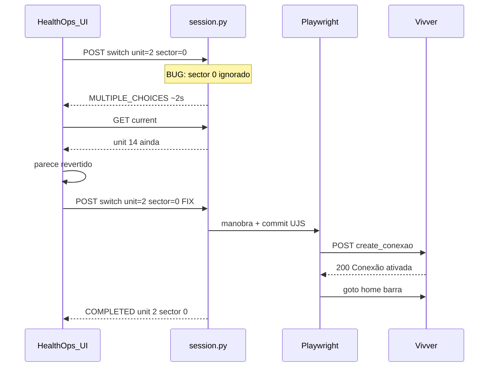

# Root Cause Analysis — Persistência Contextual Vivver

**Data:** 15/05/2026  
**Status:** Resolvido e validado em runtime  
**Escopo:** Troca de Unidade + Setor via `POST create_conexao`  
**Município de referência:** `3128253` (Guaraciama-MG)

---

## 1. Resumo executivo

O HealthOps **preenchia o formulário de conexão corretamente na tela**, mas a sessão operacional no Vivver **não persistia de forma soberana** em parte dos cenários. A causa não era “Playwright instável” de forma genérica: era uma **combinação de falha semântica** (`sector_id="0"`), **bypass do protocolo Rails UJS** (`forms[0].submit()`), e **validação contra sinais errados** (DOM aparente vs estado ERP).

Três camadas de causa raiz:

| Camada | Causa | Sintoma observado |
|--------|--------|-------------------|
| **API / resolução** | `sector_id="0"` tratado como ausente (falsy) | `MULTIPLE_CHOICES_REQUIRED` em ~2s, sem manobra |
| **Protocolo ERP** | Submit nativo paralelo ao UJS | POST duplo; 2º POST sem CSRF/commit |
| **Coerência de estado** | UI HealthOps assumia troca antes do commit | TopBar revertia; overlay travado |

---

## 2. Causa raiz verdadeira

### 2.1 Protocolo de commit não respeitado (primária histórica)

O Vivver persiste contexto **somente** quando um único `POST` XHR UJS atinge:

`POST /seg/operador/{codoperador}/create_conexao`

com headers `X-CSRF-Token` + `X-Requested-With: XMLHttpRequest`, payload incluindo pares `lookup_key[seg_operador[...]]` **e** `commit=Confirmar`, e resposta `200` com corpo contendo **`Conexão ativada com sucesso`**.

O fluxo legado em `PlaywrightContextSwitcher` fazia:

1. Enter no botão (às vezes dispara UJS — POST correto)
2. `document.forms[0].submit()` como fallback (sempre dispara POST **document** incompleto)

**Evidência:** [`backend/evidence/context-switch/legacy_trace.json`](../../../backend/evidence/context-switch/legacy_trace.json) — `create_conexao_post_count: 2`; POST #2 sem `X-CSRF-Token` e sem `commit=Confirmar`.

Referência limpa (1 POST): [`ujs_click_trace.json`](../../../backend/evidence/context-switch/ujs_click_trace.json).

### 2.2 Semântica incorreta de `sector_id="0"` (primária do bug PSF)

No Vivver, **`codsetor=0` é um identificador válido** (ex.: setor **ATENDIMENTO** na unidade **PSF SAUDE PARA TODOS**, `unit_id=2`).

O backend aplicava lógica equivalente a “se não tem setor”:

```python
# ANTES (incorreto) — session.py / context_switcher.py
if not sector_id or sector_id == "0":
    # auto-resolve ou SECTOR_REQUIRED
```

Em Python, `"0"` é truthy, mas padrões como `if not sector_id` após coerção numérica, ou checagens `sector_id == "0"` explícitas, **descartavam** o setor explícito. O efeito prático:

- `POST /switch?unit_id=2&sector_id=0` → resolução automática de setores
- Unidade 2 tem **dois** setores (`0` ATENDIMENTO, `1` SALA DE VACINA)
- API retornava `MULTIPLE_CHOICES_REQUIRED` em **~1–2 segundos**
- **Nenhuma** navegação Playwright para `/seg/operador/conexao`
- `GET /current` permanecia em **unidade 14** (Almoxarifado)

**Correção:** tratar apenas `""` e `AUTO_RESOLVE` como ausência; `"0"` é explícito.

```python
# DEPOIS (correto) — session.py
if sector_id is not None and str(sector_id).strip() not in ("", "AUTO_RESOLVE"):
    return str(sector_id).strip(), "EXPLICIT"
```

### 2.3 DOM preenchido ≠ sessão ERP persistida

Select2 e inputs hidden podem exibir **14 / ALMOXARIFADO** na tela de conexão enquanto a **barra inferior** (`#unidade_info`, `#setor_info`) e o cookie `_vmx_saude_session` ainda refletem o contexto anterior.

**Sinais soberanos de persistência** (ordem de confiança):

1. Exatamente **um** POST `create_conexao` (xhr) com sucesso semântico no body
2. **`session_fingerprint`** alterado (rotação de sessão)
3. Barra ERP em `/` com IDs/nomes alinhados ao alvo

---

## 3. Por que o comportamento parecia aleatório

| Fator | Efeito |
|-------|--------|
| Enter vs fallback `submit()` | Às vezes só POST #1 (ok); às vezes POST #1 + #2 (corrida) |
| Setor `0` só em algumas unidades | PSF falhava; Almoxarifado (`sector_id=10`) parecia “funcionar” |
| Cache frontend + `/current` stale | UI mostrava troca local; ERP não mudou |
| Deadlock `_browser_lock` | Overlay “Troca no Vivver em andamento…” sem progresso |
| Seletores de header errados (`.unidade_nome`) | Validação pós-switch lia `N/A` mesmo com commit ok |
| `ERR_ABORTED` em `goto` pós-commit | Vivver já redirecionava; segundo `goto` falhava a manobra |

Isso produzia a percepção de “funciona na Almoxarifado, não no PSF” e “às vezes volta sozinho” — **não era aleatoriedade de rede**, era **ramificação determinística** por ID de setor e por caminho de submit.

---

## 4. Por que `sector_id="0"` impedia persistência real

Fluxo causal:

```
UI: usuário escolhe PSF + ATENDIMENTO (key "0")
  → frontend envia sector_id=0
  → API: sector_id descartado como inválido
  → MULTIPLE_CHOICES_REQUIRED (rápido)
  → Playwright NÃO executa create_conexao
  → ERP permanece unit 14 / sector 10
  → fetchSession ou merge: UI “corrige” para Almoxarifado
```

**Importante:** o ERP não “rejeitava” o setor 0 — o HealthOps **nem chegava** a enviar o commit com `codsetor=0`.

---

## 5. Intenção UI vs commit real

| Dimensão | Intenção UI (HealthOps) | Commit real (Vivver) |
|----------|-------------------------|----------------------|
| Onde vive | `SessionContext`, TopBar, catálogos | Sessão Rails + cookie `_vmx_saude_session` |
| Momento da “troca” | Ao clicar Confirmar no modal | Após POST `create_conexao` 200 + JS de sucesso |
| Identificadores | `unit.id`, `sector.id` do estado React | `seg_operador[codunidade]`, `seg_operador[codsetor]` + `lookup_key[...]` |
| Validação | Labels no TopBar | `#unidade_info` / `#setor_info` + fingerprint |
| Falha silenciosa | `fetchSession` sobrescreve com `/current` antigo | N/A — ERP nunca mudou |



---

## 6. Before / After (snapshots lógicos)

### Before (API, setor 0 rejeitado)

```http
POST /almox/v1/session/switch?unit_id=2&sector_id=0
→ 200 { "status": "MULTIPLE_CHOICES_REQUIRED", "error": "Selecione o setor explicitamente." }
(~2s)

GET /almox/v1/session/current
→ { "unit": { "id": "14", "name": "ALMOXARIFADO DA SAUDE" }, "sector": { "id": "10", ... } }
```

### After (protocolo + resolução corretos)

```http
POST /almox/v1/session/switch?unit_id=2&sector_id=0
→ 200 { "status": "COMPLETED", "unit_name": "PSF SAUDE PARA TODOS", "sector_name": "ATENDIMENTO" }
(~24s cold, ~5s warm)

GET /almox/v1/session/current
→ { "unit": { "id": "2", ... }, "sector": { "id": "0", "name": "ATENDIMENTO" } }
```

### Barra ERP (soberana)

| Elemento | Antes | Depois |
|----------|-------|--------|
| `#unidade_info` | `14 - ALMOXARIFADO DA SAUDE` | `2 - PSF SAUDE PARA TODOS` |
| `#setor_info` | `10 - ALMOXARIFADO` | `0 - ATENDIMENTO` |

HTML de referência: [`backend/evidence/context-switch/vivver_home_after_login.html`](../../../backend/evidence/context-switch/vivver_home_after_login.html).

---

## 7. Hipóteses descartadas (não eram causa raiz)

- “Só falta mais `sleep`” — mascarava corrida, não criava POST válido
- “CSRF só no `<input hidden>`” — Vivver usa meta + header `X-CSRF-Token`
- “Primeiro setor da lista” — viola regra de setor explícito; setor errado
- “Header `.unidade_nome`” — seletor inexistente na home atual
- “Fechar browser resolve tudo” — sintoma de sessão; não substitui protocolo
- “Bug só no frontend” — API falhava antes do Playwright no caso `sector_id=0`

---

## 8. Referências

- [COMMIT_PROTOCOL_v1.md](./COMMIT_PROTOCOL_v1.md)
- [CONTEXT_SWITCH_EVOLUTION.md](./CONTEXT_SWITCH_EVOLUTION.md)
- [VALIDATED_SCENARIOS.md](./VALIDATED_SCENARIOS.md)
- Código: [`session.py`](../../../backend/app/api/v1/session.py), [`conexao_commit.py`](../../../backend/app/core/auth/adapters/playwright/clients/conexao_commit.py)
